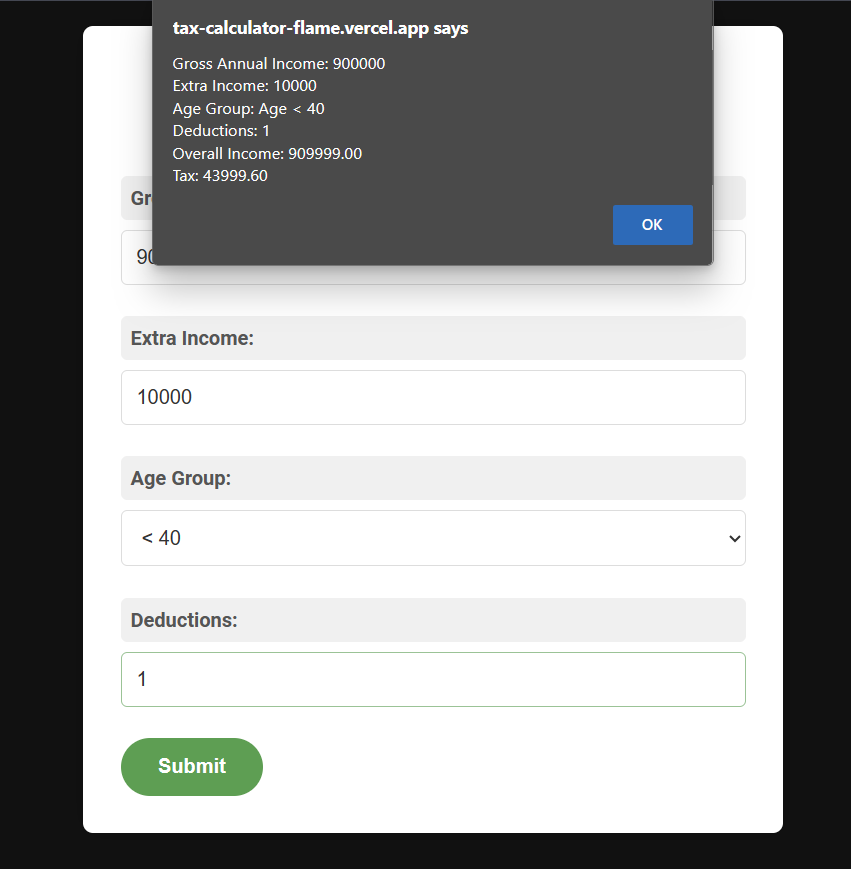
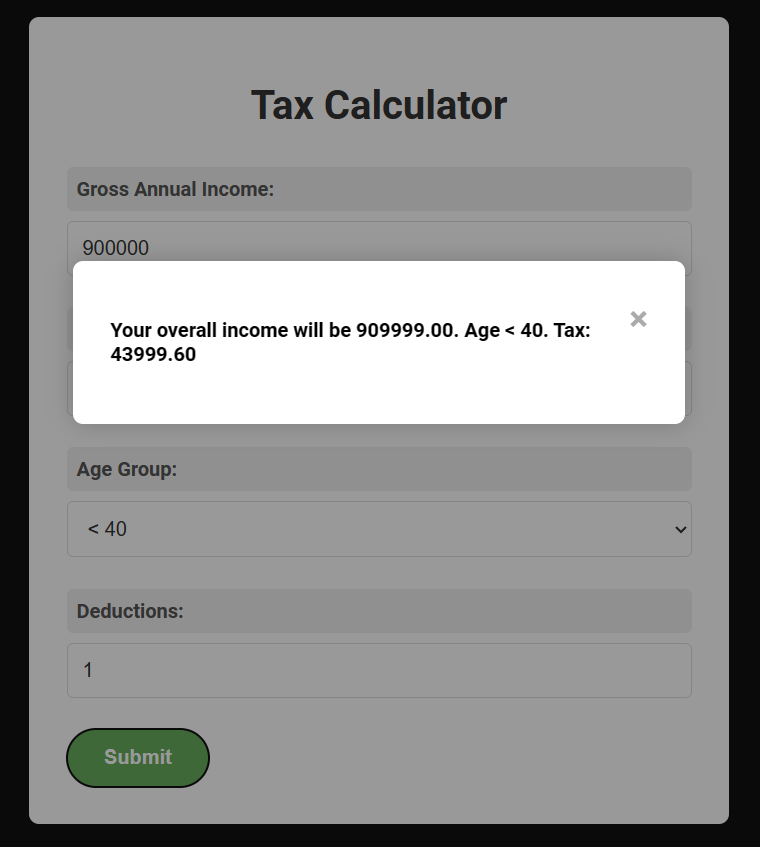
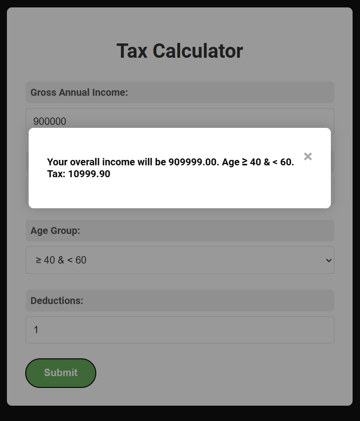
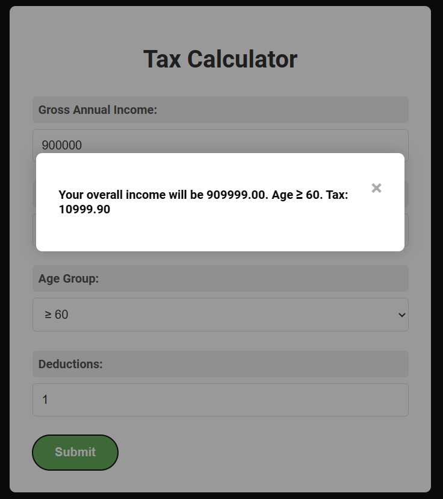
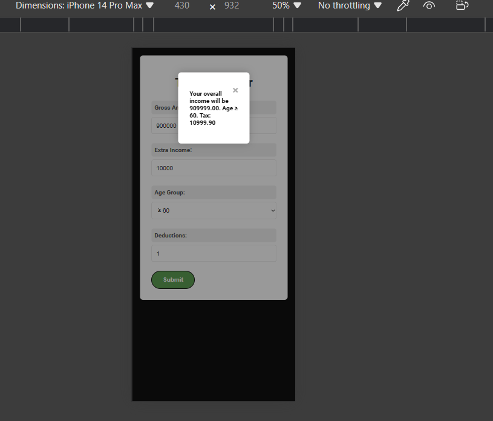

# Tax Calculator

## Introduction
This is a simple tax calculator web application that helps users calculate their taxes based on their income, age group, and deductions.

## Demo
[View Demo](https://tax-calculator-flame.vercel.app/)

## Getting Started
1. Clone the repository: `https://github.com/um500/Tax-Calculator.git`
2. Navigate to the project directory: `cd tax-calculator`
3. Open `index.html` in your web browser.

## Usage
1. Enter your gross annual income, extra income, age group, and deductions in the form fields.
2. Click the "Submit" button to calculate your tax.
3. View the calculated tax amount in the modal window.

## Features
- Calculate tax based on income, age group, and deductions.
- Responsive design for various screen sizes.
- Error handling for invalid inputs.

## Contributing
Contributions are welcome! Please follow these guidelines:
1. Fork the repository.
2. Create a new branch: `git checkout -b feature/new-feature`.
3. Make your changes and commit them: `git commit -am 'Add new feature'`.
4. Push to the branch: `git push origin feature/new-feature`.
5. Submit a pull request.

## License
This project is licensed under the MIT License - see the [LICENSE](LICENSE) file for details.

## Acknowledgements
- This project is inspired by [Tax Calculator].
  
##Screensort

